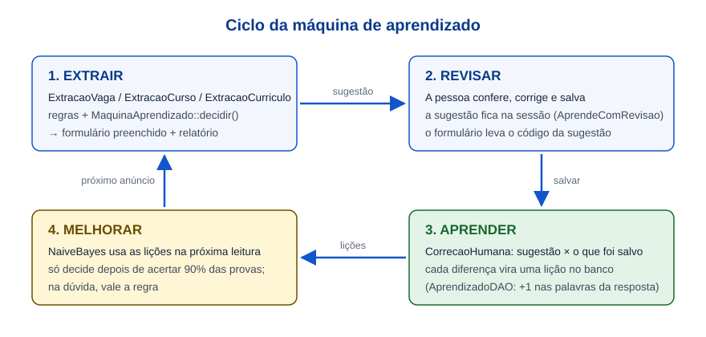
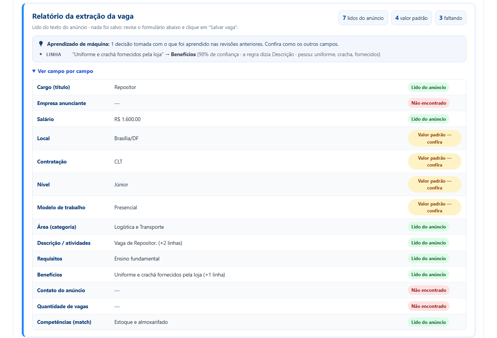
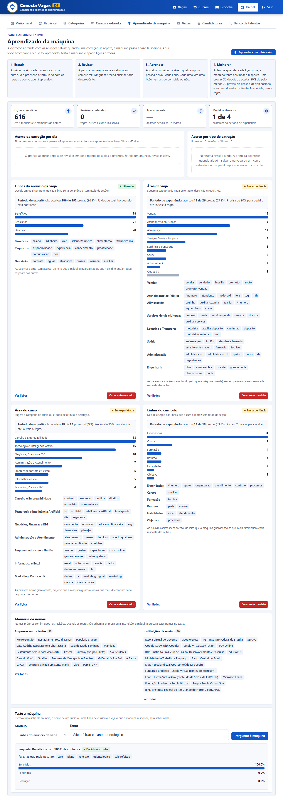

# Máquina de aprendizado — Conecta Vagas DF

Como as máquinas de extração (vaga, curso e currículo) aprendem com as revisões das pessoas.
Visão geral do sistema: [ARQUITETURA.md](ARQUITETURA.md).



---

## 1. O problema

As máquinas de extração funcionam com **regras escritas à mão**: listas de palavras-chave. Por exemplo, se a linha
tem "VT", "VR" ou "plano de saúde", ela vai para Benefícios; se tem "experiência" ou "ensino médio", vai para Requisitos.

Funciona bem, mas tem um limite: todo anúncio escrito de um jeito novo pede alguém para abrir o código e
acrescentar palavras na lista. "Uniforme e crachá fornecidos" não tem nenhuma palavra da lista de benefícios, então
a regra põe a linha na Descrição, e a empresa precisa movê-la na mão a cada anúncio parecido.

## 2. A ideia

A pessoa **já corrige** a máquina toda vez que revisa o formulário antes de salvar. Essa correção é exatamente a
"resposta certa" de que um algoritmo de aprendizado precisa, e até agora era descartada.

Agora ela é aproveitada:

1. **Extrair**: a máquina lê o anúncio e preenche o formulário (regras + o que já aprendeu);
2. **Revisar**: a pessoa confere, corrige e salva, como sempre fez;
3. **Aprender**: ao salvar, a máquina vê em qual campo a pessoa deixou cada linha; cada uma vira uma **lição**,
   tenha sido corrigida ou não;
4. **Melhorar**: no próximo anúncio a máquina já usa essas lições.

Na literatura isso se chama **aprendizado supervisionado incremental com a pessoa no ciclo** (*human-in-the-loop*).
Ninguém precisa treinar a máquina de propósito: ela aprende com o uso.

**Vocabulário usado neste documento e no código:**

| Termo | Significado |
|---|---|
| lição | um exemplo rotulado: um texto e a resposta certa. No código e no banco o nome é *exemplo*. |
| classe | a resposta certa de uma lição: o campo (em `vaga_linha`), a seção (em `curriculo_linha`) ou a área (nos modelos de categoria). Na tela aparece como "resposta". |
| modelo | o conjunto de contadores aprendidos para uma tarefa (ex.: `vaga_linha`). |

Exemplo testado no sistema, com o modelo já alimentado pelo histórico (passo 2 do roteiro da seção 10): depois de
uma revisão em que a empresa moveu "Uniforme e crachá fornecidos" para Benefícios, o anúncio seguinte com "Uniforme e
crachá fornecidos pela loja" já veio em Benefícios, com 98% de confiança, e o relatório da extração mostra o motivo:



## 3. O algoritmo: Naive Bayes

Escolhemos o **Naive Bayes multinomial**, o mesmo algoritmo clássico dos filtros de spam de e-mail
(MANNING; RAGHAVAN; SCHÜTZE, 2008, cap. 13). Motivos:

| Critério | Por que ele serve |
|---|---|
| Roda no XAMPP | PHP puro, sem Python, sem GPU, sem serviço pago. |
| Aprende aos poucos | Aprender é **somar contadores**; esquecer é subtrair. Não existe "treinar de novo do zero". |
| Funciona com poucos exemplos | Chega perto do seu melhor desempenho com menos exemplos do que a regressão logística (NG; JORDAN, 2002); redes neurais costumam pedir ainda mais dados. |
| É explicável | Dá para mostrar **quais palavras** pesaram na decisão, o que ajuda quem revisa a confiar (ou não) na sugestão. |

### Como ele decide (sem fórmula)

Cada classe ("beneficios", "requisitos", "descricao") tem um caderninho onde a máquina anota quantas vezes viu cada
palavra. Depois de ver "vale refeição" em 30 linhas de benefícios e em nenhuma de requisitos, ela aposta que a
próxima linha com "vale refeição" é benefício. Quanto mais a linha tem palavras frequentes num caderninho e raras nos
outros, maior a aposta.

### Com a fórmula

Para cada classe `c`, com as palavras `p1..pn` da linha (só as que o modelo já viu; as desconhecidas são ignoradas):

```
pontos(c) = log P(c) + log P(p1|c) + ... + log P(pn|c)

P(c)   = lições da classe c / total de lições                                   (quão comum é a classe)
P(p|c) = (vezes que p apareceu em c + 1) / (palavras de c + tamanho do vocabulário)
```

- O **+1** é a *suavização de Laplace*: sem ele, uma palavra que nunca apareceu em `c` (mas apareceu em outra classe)
  zeraria a conta de `c`.
- O **logaritmo** existe porque multiplicar muitas probabilidades pequenas dá um número tão perto de zero que o
  computador arredonda para 0; somando logaritmos isso não acontece.
- No fim os pontos viram porcentagens (*softmax*): é a **confiança** mostrada na tela.
- "Ingênuo" (*naive*) porque ele supõe que as palavras são independentes entre si, dada a classe. Não é verdade, mas
  para classificar texto curto costuma funcionar bem (McCALLUM; NIGAM, 1998).

### Como o texto vira palavras (Tokenizador)

```
"Vale-Refeição de R$ 33,40 + Plano de Saúde"
  → vale · refeicao · #dinheiro · plano · saude · vale refeicao · ... · plano saude
```

Valores em dinheiro viram `#dinheiro` e números soltos viram `#numero` (o valor exato não importa, importa saber que
tem um valor ali); o texto fica sem acento e em minúsculas; palavras vazias ("de", "para", "com") saem; e entram também
os **pares de palavras vizinhas**, porque "plano saude" diz muito mais que "plano" e "saude" separados.

## 4. Modelo híbrido: a regra é a rede de segurança

A máquina **não substitui** as regras, trabalha junto com elas (`MaquinaAprendizado::decidir()`):

| Situação | Quem decide |
|---|---|
| O modelo tem menos de **20 lições** | a regra |
| A classe que o modelo quer tem menos de **3 lições** | a regra |
| O modelo está com menos de **80% de confiança** neste texto | a regra |
| O modelo ainda não passou no **período de experiência** (abaixo) | a regra |
| Passou em tudo e discorda da regra | **a máquina** |

Ainda assim ele pode errar; por isso, nas vagas e nos cursos, cada decisão da máquina aparece no relatório da
extração com o motivo, para a pessoa conferir. Os limites ficam em constantes no topo de `MaquinaAprendizado`
(`MIN_LICOES`, `MIN_LICOES_CLASSE`, `CONFIANCA_MINIMA`, `MIN_PROVAS`, `PRECISAO_MINIMA`).

### Período de experiência (testar antes de aprender)

A "confiança" do Naive Bayes sai exagerada: quase tudo aparece perto de 100%. Na revisão técnica do projeto, deixando
uma vaga de fora por vez e prevendo com o resto, a **área da vaga** ficou **pior** com a máquina (44 acertos em 62) do
que só com a regra (50 em 62), mesmo com o limite de 80%. Então a confiança sozinha não basta.

A solução é a **avaliação prequencial** (DAWID, 1984; GAMA; SEBASTIÃO; RODRIGUES, 2013), que aqui chamamos de
período de experiência:

1. antes de aprender cada lição **nova**, o modelo tenta adivinhar a resposta com o que já sabia;
2. se ele estava confiante (os critérios da tabela acima), isso conta como uma **prova**, e o acerto é anotado
   (tabela `aprendizado_provas`);
3. o modelo só é **liberado** para decidir depois de pelo menos **20 provas** com **90% ou mais** de acerto.

Como cada prova é feita com uma lição que o modelo ainda não tinha visto, o acerto medido é honesto. Com os dados de
demonstração ("Aprender com o histórico"), o resultado foi:

| Modelo | Acertos nas provas | Situação |
|---|---|---|
| Linhas do anúncio de vaga | 186 de 192 (96,9%) | **liberado** |
| Área da vaga | 18 de 26 (69,2%) | em experiência: vale a regra |
| Área do curso | 19 de 28 (67,9%) | em experiência: vale a regra |
| Linhas do currículo | 15 de 18 (83,3%) | em experiência: vale a regra |

Ou seja, o critério libera exatamente o modelo que ajuda e segura o que pioraria a extração. À medida que chegam
revisões novas, as provas continuam e um modelo pode ser liberado mais tarde.

**O que continua só com regra**, de propósito: e-mail, telefone, salário (R$), CNH e datas. São dados de formato
fixo, que uma expressão regular reconhece melhor do que um modelo que conta palavras.

## 5. O que cada máquina aprende

| Modelo | Aprende | Com qual revisão | Onde é usado |
|---|---|---|---|
| `vaga_linha` | Em qual campo vai cada linha solta do anúncio (descrição, requisitos, benefícios) | vaga extraída e salva | `ExtracaoVaga::doTexto`, linhas sem título de seção |
| `vaga_categoria` | A área da vaga pelo título, descrição e requisitos | vaga extraída e salva | `ExtracaoVaga::doTexto` |
| `curso_categoria` | A área do curso/e-book pelo título e descrição | curso extraído e salvo | `ExtracaoCurso::doTexto` e `fichas` |
| `curriculo_linha` | A seção das linhas que o currículo traz sem título | perfil salvo depois de enviar o currículo | `ExtracaoCurriculo`, linhas do cabeçalho |

E duas **memórias de nomes**. Elas não usam estatística: são uma lista de nomes já confirmados, procurados no texto.

| Memória | O que guarda | Quando é usada |
|---|---|---|
| `vaga_empresa` | Empresa anunciante confirmada, desde que o nome estivesse escrito no anúncio | quando nenhuma regra achou a empresa |
| `curso_instituicao` | Instituição confirmada no cadastro do curso, desde que o nome estivesse escrito no texto | quando nenhuma regra achou a instituição |

## 6. Cuidados para não aprender errado

- **Só aprende quando não há dúvida sobre o destino da linha.** Uma linha só vira lição se a pessoa a deixou em **um**
  campo. Se apagou ou reescreveu a linha, ou se ela aparece em dois campos, a máquina não aprende nada com ela.
- **Só com o formulário que ela preencheu.** O formulário leva um código da sugestão (campo escondido
  `sugestao_maquina`). Se a pessoa extraiu um anúncio, desistiu e depois editou outra vaga à mão, as duas coisas não se
  misturam. A sugestão vale por 2 horas e ensina uma vez só. (No currículo não há código: a sugestão e o perfil
  salvo são do mesmo candidato logado.)
- **A mesma frase não conta duas vezes.** Cada lição tem uma chave (SHA-1 do texto normalizado). Frase repetida só é
  "confirmada" (+1 no contador de vezes, sem mexer nos contadores de palavras); se a resposta mudou, **vale a correção
  mais recente**: a frase sai do caderninho antigo e entra no novo.
- **Uma pessoa sozinha não desfaz o que várias ensinaram.** Se a lição já foi confirmada em 2 revisões ou mais, só o
  administrador pode trocar a resposta dela.
- **Nome só é lembrado se estava no texto**, se não é o cargo nem a cidade, e se não é genérico: "Vaga", "Salário",
  "Loja" e parecidos são recusados, senão virariam "empresa" nos anúncios de todo mundo.
- **Dados pessoais do currículo ficam onde estão.** Linhas do cabeçalho com idade, estado civil, nacionalidade ou
  endereço nunca são movidas para uma seção do portfólio, mesmo que o modelo tenha certeza.
- **LGPD.** O texto do currículo não fica guardado na sessão; o "Aprender com o histórico" só lê perfis **públicos**;
  cada lição de currículo fica no nome do candidato e, quando a conta dele é excluída, essas lições são esquecidas
  (e as palavras delas saem do modelo).
- **Nunca derruba a página.** Na extração e no salvamento, qualquer erro no aprendizado (banco desligado, tabela
  faltando) vai para o log do PHP e tudo segue normal, só sem aprender.
- **Tem botão de desfazer.** No painel dá para esquecer uma lição errada ou zerar um modelo inteiro.

## 7. Painel "Aprendizado da máquina"

Painel → aba **Aprendizado da máquina** (só administrador), endereço `admin/pages/aprendizado.php`.



- **Indicadores**: lições aprendidas, revisões conferidas, acerto recente × acerto no começo, modelos liberados
  (os que passaram no período de experiência);
- **Acerto da extração por dia** e **acerto por tipo de extração** (primeiras 10 revisões × últimas 10): o indicador de
  evolução. Mostra uma tendência, não uma medição controlada (ver seção 12);
- **O que cada modelo aprendeu**: o período de experiência (provas, acertos e se está liberado), as lições por
  resposta e as palavras mais típicas de cada uma;
- **Memória de nomes**: empresas e instituições confirmadas;
- **Teste a máquina**: escreve-se um texto e vê-se a resposta, a confiança, se ela já decidiria sozinha e as palavras
  que pesaram, sem salvar nada;
- **Aprender com o histórico**: ensina a máquina com as vagas, cursos e perfis que já estão cadastrados (em geral
  revisados por pessoas). Serve para uma instalação nova não começar do zero. Pode rodar de novo à vontade: lição
  repetida só é confirmada;
- **Últimas lições**: o que foi aprendido, de quem, quando e quantas vezes foi confirmado, com o botão **Esquecer**.

## 8. Arquivos (MVC)

Cada peça faz uma coisa só, e as peças dependem pouco umas das outras (alta coesão, baixo acoplamento):

| Camada | Arquivo | Responsabilidade |
|---|---|---|
| Service | `app/Services/Aprendizado/Tokenizador.php` | Texto → palavras. |
| Service | `app/Services/Aprendizado/NaiveBayes.php` | O algoritmo puro: aprender, esquecer, prever, explicar. Não conhece banco nem tela. |
| Service | `app/Services/Aprendizado/CorrecaoHumana.php` | Compara a sugestão com o que foi salvo e tira as lições. Só contas, sem banco. |
| Service | `app/Services/Aprendizado/MaquinaAprendizado.php` | Porta de entrada: decisão híbrida, aprender com a revisão, histórico, esquecer/zerar. |
| Model | `app/Models/AprendizadoDAO.php` | SQL das três tabelas; cria as tabelas sozinho se não existirem. |
| Controller | `app/Controllers/AprendeComRevisao.php` | *Trait* dos controllers: guarda a sugestão na sessão e aprende ao salvar. |
| Controller | `app/Controllers/AprendizadoController.php` | Tela do painel e as ações (histórico, esquecer, zerar). |
| View | `app/Views/admin/aprendizado.php` | Tela do painel. |
| View | `painel_decisoes_maquina()` em `app/Views/partials/graficos.php` | Caixa "Aprendizado de máquina" no relatório da extração. |

Pontos de ligação com o que já existia (poucas linhas em cada um):

| Onde | O que foi acrescentado |
|---|---|
| `ExtracaoVaga::doTexto` | `decidir()` nas linhas soltas e na área; memória de empresas quando a regra não acha; `$r['linhas']` e `$r['maquina']`. |
| `ExtracaoCurso::doTexto` / `fichas` | `decidir()` na área; memória de instituições. |
| `ExtracaoCurriculo::extrairCampos` | `secoesAprendidas()` para as linhas do cabeçalho; `linhasDoTexto()`. |
| `EmpresaController::vagas` e `AdminController::cursos` | guardar a sugestão ao extrair; aprender ao salvar (e a mensagem "a máquina aprendeu N lições"). |
| `CurriculoController::upload` e `PerfilController::salvar` | guardar a sugestão no envio do currículo; aprender quando o perfil é salvo. |
| `admin/vagas.php` e `admin/cursos.php` | campo escondido `sugestao_maquina` e a caixa das decisões da máquina. |

## 9. Banco de dados

Quatro tabelas (em `database/schema.sql`; o `AprendizadoDAO` também cria as quatro se o banco for de antes delas):

```
aprendizado_exemplos   uma linha por lição: modelo, classe (resposta certa), texto, chave, vezes, quem ensinou
aprendizado_palavras   os contadores do Naive Bayes: modelo + classe + palavra → contagem  (é o "modelo" em si)
aprendizado_revisoes   uma linha por revisão salva (origem vaga, curso ou curriculo): campos e linhas conferidos
                       e acertados, lições tiradas
aprendizado_provas     o período de experiência: por modelo, quantas provas fez e quantas acertou
```

Guardar as lições (`exemplos`) além dos contadores (`palavras`) é o que permite **esquecer** uma lição específica e
conferir tudo o que a máquina aprendeu. O texto de cada lição é guardado com até 500 caracteres, e as palavras
contadas saem desse mesmo texto: assim, ao esquecer, o sistema desconta exatamente o que tinha somado.

## 10. Roteiro para a apresentação

1. Abra **Aprendizado da máquina**: tudo zerado, todos os modelos "Em experiência".
2. Clique em **Aprender com o histórico**: a máquina estuda as vagas, cursos e perfis do seed (cerca de 760 lições em
   poucos segundos). "Linhas do anúncio de vaga" fica **Liberado** (acertou ~97% das provas) e os outros continuam
   em experiência. Vale explicar: a máquina sabe quando ainda não é boa o bastante. A área da vaga acertaria só ~70%,
   pior que a regra, então ela não decide. Mostre as palavras típicas de Benefícios e Requisitos.
3. Em **Teste a máquina**, escreva "Vale refeição e plano odontológico" → Benefícios, com as palavras que pesaram.
4. Vá em **Vagas**, cole um anúncio com a linha "Uniforme e crachá fornecidos" e extraia: a regra põe em Descrição.
   Mova a linha para Benefícios e salve → "A máquina de extração aprendeu N lições com a sua revisão."
5. Extraia outro anúncio com "Uniforme e crachá fornecidos pela loja": agora vem em **Benefícios**, e o relatório
   mostra "a regra dizia Descrição · pesou: uniforme, cracha, fornecidos" (as palavras aparecem sem acento, do jeito
   que a máquina guarda).
6. Volte ao painel: a revisão aparece nos indicadores e a lição aparece em **Últimas lições** (com o botão Esquecer).

## 11. Manutenção

**Ajustar o quanto a máquina arrisca**: constantes `MIN_LICOES`, `MIN_LICOES_CLASSE`, `CONFIANCA_MINIMA`,
`MIN_PROVAS` e `PRECISAO_MINIMA` em `MaquinaAprendizado`. Valores mais altos deixam a máquina mais cautelosa
(decide menos, erra menos).

**Acrescentar um modelo novo** (ex.: nível da vaga pelo texto):
1. declarar em `MaquinaAprendizado::MODELOS` (nome, título, descrição e rótulos das classes);
2. na extração, trocar a decisão da regra por `MaquinaAprendizado::decidir('modelo', $texto, $palpiteDaRegra)`;
3. dizer em `REVISOES` de onde vem a resposta certa (qual campo salvo);
4. o painel mostra o modelo novo sozinho.

**Desligar o aprendizado** (ex.: para comparar com e sem): `MaquinaAprendizado::ligar(false)`. Os testes das regras
em `tests/smoke.php` rodam assim, para o que foi aprendido no banco não mudar o resultado deles.

**Testes**: `tests/smoke.php`, seção "2b. Máquina de aprendizado". Confere o tokenizador, o Naive Bayes (aprender, prever,
explicar, esquecer, classe só com números), a correção humana, a decisão híbrida dentro da extração de vaga, o período
de experiência, a memória de nomes (e a recusa de nomes genéricos) e a proteção dos dados pessoais do currículo, com
modelos montados na memória (`usarModelo`, `usarNomes`, `usarProvas`), sem depender do que está gravado no banco. A seção 3 do mesmo teste
confere, no MySQL, se as tabelas do aprendizado existem (ou são criadas).

## 12. Limites (o que ela não faz)

- Não lê imagem nem "entende" frases: conta palavras. Uma frase com palavras nunca vistas volta para a regra.
- Aprende só a seção das linhas e a área; não inventa informação que não está no anúncio.
- A "confiança" do Naive Bayes costuma sair exagerada (as probabilidades dele são mal calibradas): 80% no painel não
  quer dizer que ele acerta 80% das vezes. É por isso que existe o período de experiência, que mede o acerto de verdade.
- O período de experiência soma todas as provas desde o começo; um modelo que melhorou muito demora um pouco para
  compensar as provas ruins do início.
- Os pares de palavras vizinhas pioram a hipótese de independência do "ingênuo"; na prática ajudam, mas a conta fica
  ainda menos "probabilidade de verdade".
- O acerto por dia do painel mistura o que veio da regra e do modelo, e os anúncios mudam de um período para outro:
  é um indicador de tendência. A medida honesta do modelo é a das provas.
- O modelo é compartilhado por todos: uma empresa que salva errado ensina errado para as outras. As defesas são as
  provas, a regra de que uma pessoa sozinha não troca lição confirmada, e o botão **Esquecer**.
- Linhas apagadas na revisão não viram lição de "ruído" (seria um próximo passo: ensinar a máquina a descartar lixo do OCR).
- O currículo aprende quando o candidato salva o perfil; quem envia o currículo e nunca revisa o perfil não ensina nada.
  Por outro lado, o "Aprender com o histórico" lê todos os perfis, inclusive os preenchidos pelo currículo e nunca
  revisados; nesses casos a máquina aprende a própria saída.
- Nas vagas e nos cursos as decisões da máquina aparecem no relatório da extração; no currículo, ainda não.

## Referências

- MANNING, C. D.; RAGHAVAN, P.; SCHÜTZE, H. *Introduction to Information Retrieval*. Cambridge University Press, 2008.
  Cap. 13: classificação de texto e Naive Bayes (modelo multinomial e suavização de Laplace).
- McCALLUM, A.; NIGAM, K. A comparison of event models for Naive Bayes text classification. *AAAI-98 Workshop on
  Learning for Text Categorization*, 1998.
- DAWID, A. P. Present position and potential developments: some personal views. Statistical theory: the
  prequential approach. *Journal of the Royal Statistical Society, Series A*, v. 147, n. 2, p. 278-292, 1984.
- GAMA, J.; SEBASTIÃO, R.; RODRIGUES, P. P. On evaluating stream learning algorithms. *Machine Learning*, v. 90,
  p. 317-346, 2013.
- NG, A. Y.; JORDAN, M. I. On discriminative vs. generative classifiers: a comparison of logistic regression and
  naive Bayes. *Advances in Neural Information Processing Systems 14 (NIPS)*, 2002.
- MITCHELL, T. M. *Machine Learning*. McGraw-Hill, 1997. Cap. 6: aprendizado bayesiano.
- MONARCH, R. M. *Human-in-the-Loop Machine Learning*. Manning, 2021.
